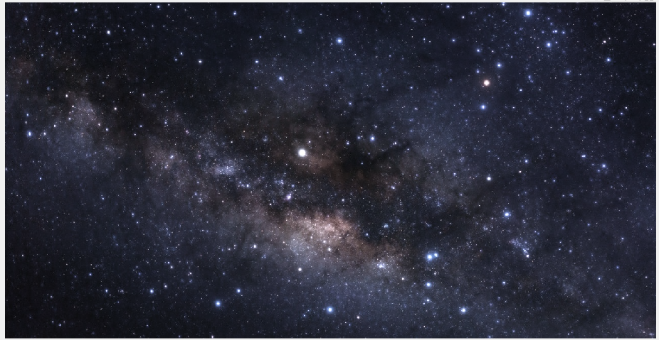
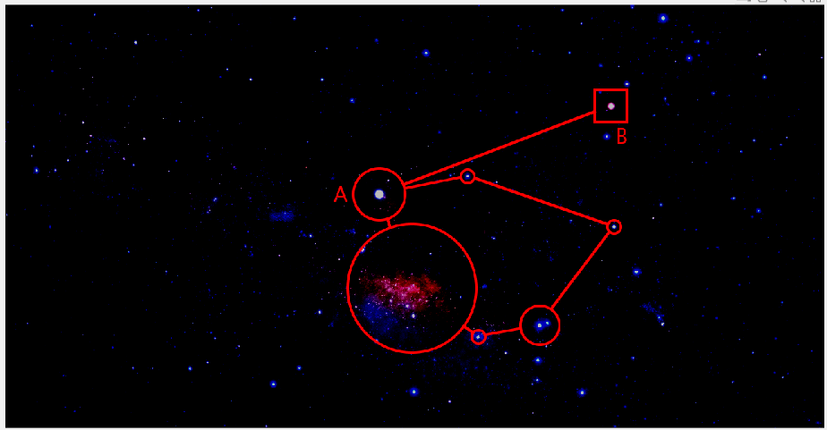
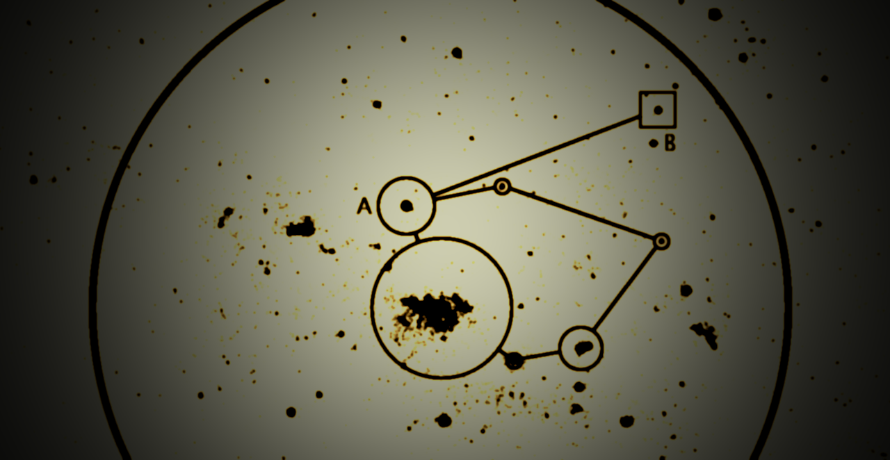

# Astronomical-Image-Mapper
An application for digital star mapping through correction, detection, and annotation of astronomical images built in MATLAB.

> ⚠️ **MATLAB License Required**
>
> This application requires a valid MATLAB license to install and run.  
> Users without a license will not be able to use it.
## What You Can Do

### Correct Images
Improve raw astronomical images by reducing noise and enhancing contrast.

**Before:**  

**After:**  

---

### Annotate Maps
Automatically detect stars and other celestial objects, annotate them.

**Before:**  

**After:**  

---

### Apply Different Filters
Experiment with filters to highlight features or enhance image quality.

**Before:**  

**After:**  

---
    

## Requirements
<pre>
- MATLAB                                                Version 9.9         (R2020b)
- Computer Vision Toolbox                               Version 9.3         (R2020b)
- Data Acquisition Toolbox                              Version 4.2         (R2020b)
- Image Acquisition Toolbox                             Version 6.3         (R2020b)
- Image Processing Toolbox                              Version 11.2        (R2020b)
</pre>

## Installation
1. Download the `.mlappinstall` file from the [Releases](../../releases) section.
2. In MATLAB, go to the toolbar and click **Install App**.
3. Choose the downloaded file to complete the installation.
   
> **Alternative:**  
> Download the source `.mlapp` file and open it as a project in **MATLAB App Designer**.

## Getting started

To begin using the application, see the [documentation](docs/index.md).
