[Back](index.md)

# Charting Tab

The **Charting** tab allows interactive mapping of objects detected in the Detection tab.  
This tab is disabled if no objects have been detected.

---

## Table of Contents

- [Modes](#modes)
  - [Move Mode](#move-mode)
  - [Select Mode](#select-mode)
- [Outline Panel](#outline-panel)
- [Label Panel](#label-panel)
- [Line Panel](#line-panel)

---

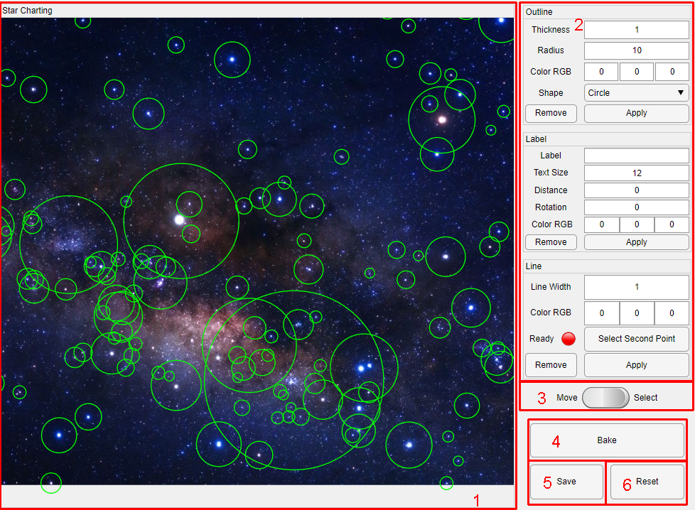

## Features

1. **Preview Window:** Displays the working image with mapped objects.
2. **Control Panel**
3. **Mode Switch:** Toggle between moving the image or selecting objects.
4. **Bake Button:** Rasterizes all map elements into the working image.
     - Locks Detection and Charting tabs for the current image.
5. **Save Button:** Applies baked image. 
6. **Reset Button:** Removes all elements from the map.

---

## Modes

### Move Mode
- Allows the user to **move or scale the image** freely.  
- Supports **zooming** and **panning**.

<table>
  <tr>
    <th>Action</th>
    <th>Result</th>
    <th>Action</th>
    <th>Result</th>
  </tr>
  <tr>
    <td>None</td>
    <td>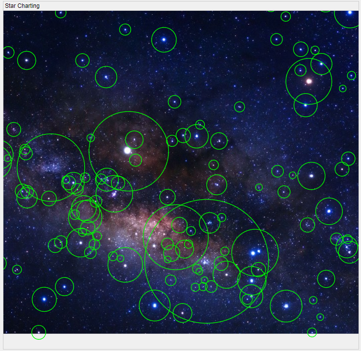</td>
    <td>Zoom in</td>
    <td>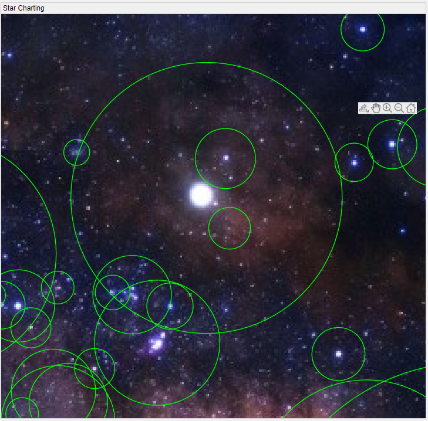</td>
  </tr>
  <tr>
    <td>Pan</td>
    <td>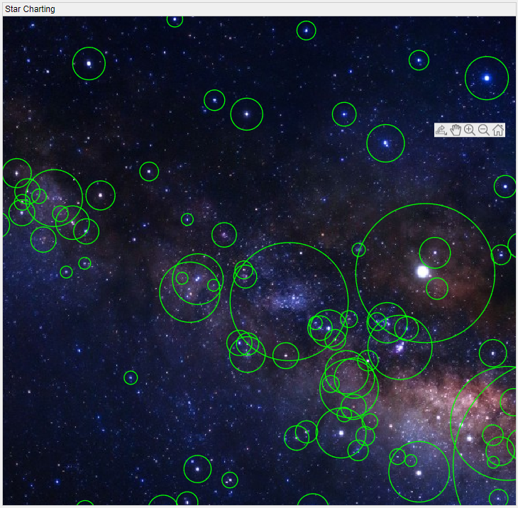</td>
    <td>Zoom out</td>
    <td>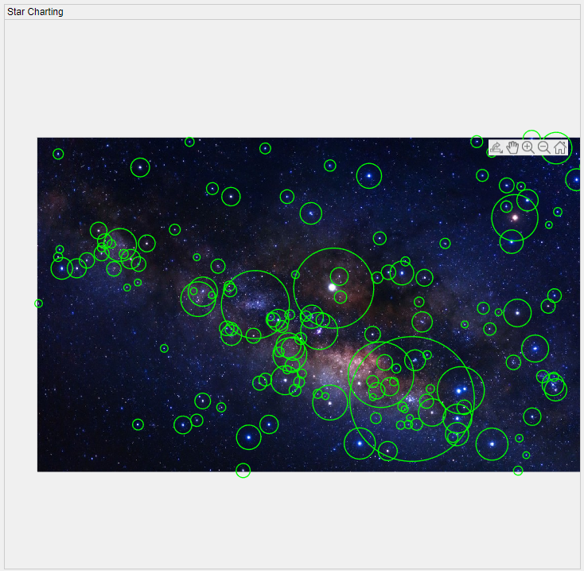</td>
  </tr>
</table>

### Select Mode
- Allows the user to **select objects** for further mapping.  
- Clicking inside a green circle selects an object (red circle appears).

<table>
  <tr>
    <td>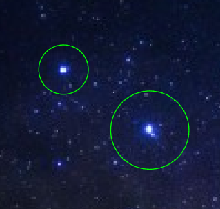</td>
    <td>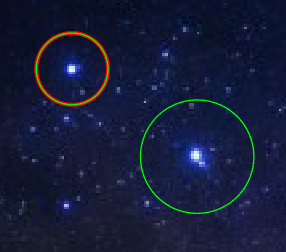</td>
    <td>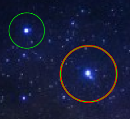</td>
  </tr>
</table>

- Clicking outside any object cancels the previous selection.

---

## Outline Panel

<table>
  <tr><th>Preview</th></tr>
  <tr><td>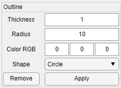</td></tr>
</table>

- Each object can have **one outline**.  
- Steps:
  1. Select an object.
  2. Click **Apply** to create or update the outline.
  3. Modify parameters at any time and click **Apply**.
  4. Click **Remove** to delete the outline.

**Parameters**

| Parameter | Description | Range |
|-----------|------------|-------|
| Thickness | Outline line thickness | 1–200 px |
| Radius    | Outline radius | 1–1000 px |
| Color RGB | Outline color | 0–1 per channel |
| Shape     | Outline shape | Circle / Square |

**Usage:**

<table>
  <tr>
    <td>Thickness</td>
    <td>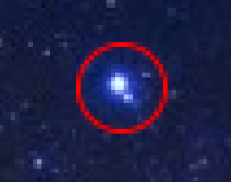</td>
    <td></td>
    <td>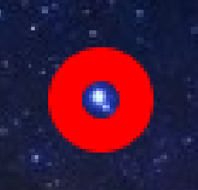</td>
  </tr>
  <tr>
    <td>Radius</td>
    <td>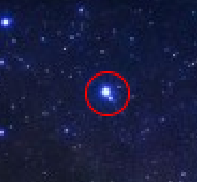</td>
    <td>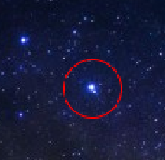</td>
    <td>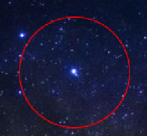</td>
  </tr>
  <tr>
    <td>Color</td>
    <td>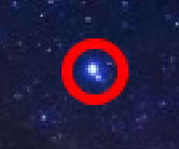</td>
    <td>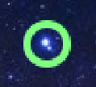</td>
    <td>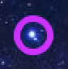</td>
  </tr>
  <tr>
    <td>Thickness</td>
    <td></td>
    <td>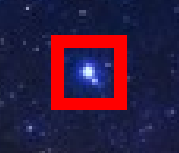</td>
    <td></td>
  </tr>
</table>
