# Correction Tab

The **Correction** tab provides tools for editing and enhancing nighttime sky images before detection and charting.

---

## Table of Contents

- [Colors](#colors)
- [Brightness](#brightness)
- [Contrast](#contrast)
- [Saturation](#saturation)
- [Sharpness](#sharpness)
- [Blur](#blur)
- [Noise Reduction](#noise-reduction)
- [Warmth (Temperature)](#warmth-temperature)

---

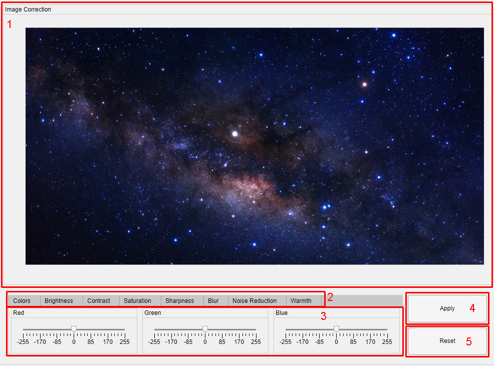

---

## Features

1. **Preview Window:** Displays the working image while edits are applied.
2. **Tool Selection Panel:** Choose which correction tool to use.
3. **Control Panel:**
4. **Apply Changes:** Saves changes for the selected tool only.
5. **Undo Last Change:** Reverts only the last applied modification.

---

## Colors
Adjust the intensity of the RGB components of the working image.

<table>
  <tr>
    <th>Preview</th>
  </tr>
  <tr>
    <td>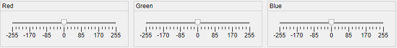</td>
  </tr>
</table>

- **Slider range:** `-255` to `+255`  
  - `-255` = remove component completely  
  - `0` = unchanged  
  - `+255` = maximum intensity  

**Usage:**
<!-- Colors Table -->
<table>
  <tr>
    <th>Value</th>
    <th>Result</th>
  </tr>
  <tr>
    <td>Original</td>
    <td>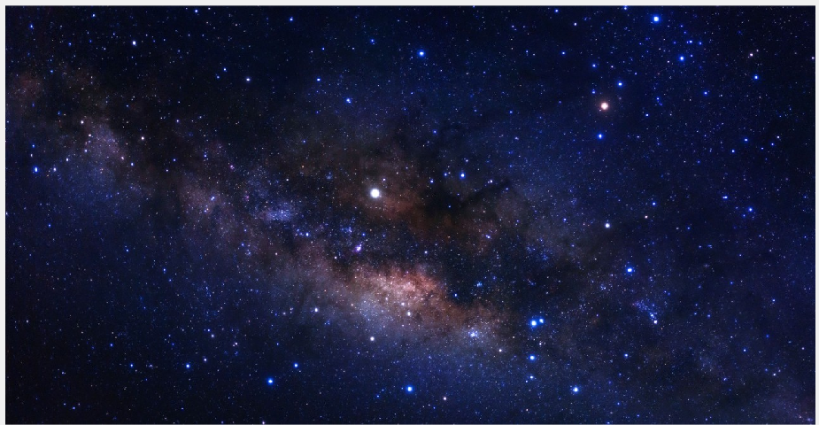</td>
  </tr>
  <tr>
    <td>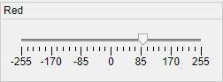</td>
    <td>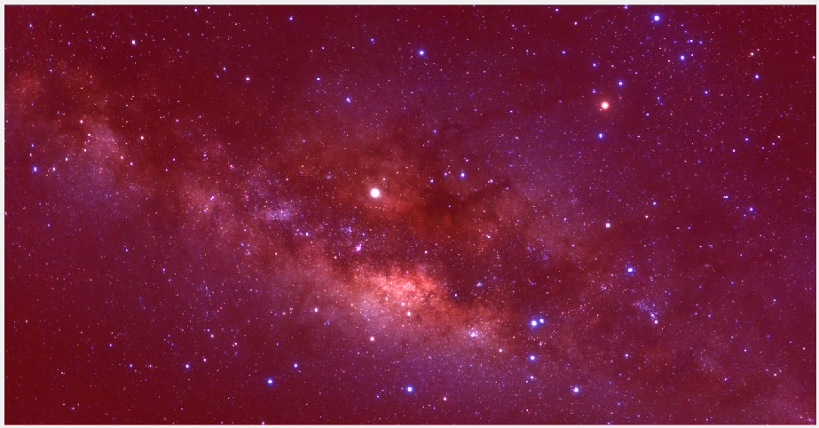</td>
  </tr>
  <tr>
    <td>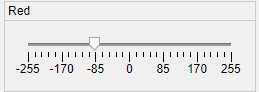</td>
    <td>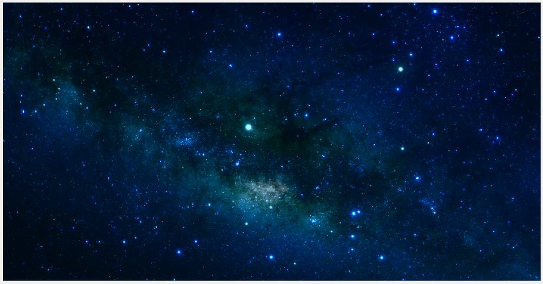</td>
  </tr>
</table>
---

## Brightness
Adjust the brightness of the working image.

<table>
  <tr>
    <th>Preview</th>
  </tr>
  <tr>
    <td>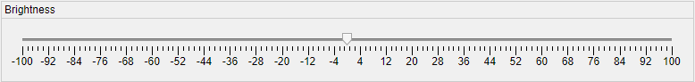</td>
  </tr>
</table>

- **Slider range:** `-100` to `100`  
  - `-100` = very dark  
  - `0` = unchanged  
  - `100` = very bright  

**Usage:**
<!-- Brightness Table -->
<table>
  <tr>
    <th>Value</th>
    <th>Result</th>
  </tr>
  <tr>
    <td>Original</td>
    <td></td>
  </tr>
  <tr>
    <td>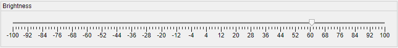</td>
    <td>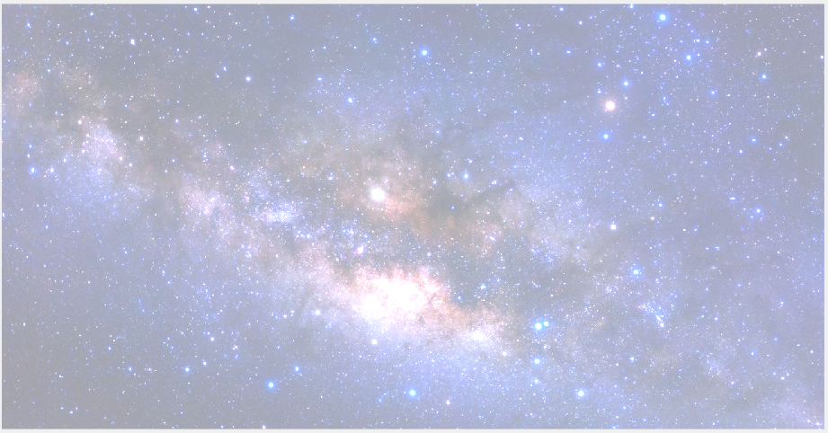</td>
  </tr>
  <tr>
    <td>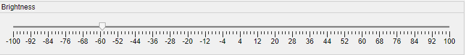</td>
    <td>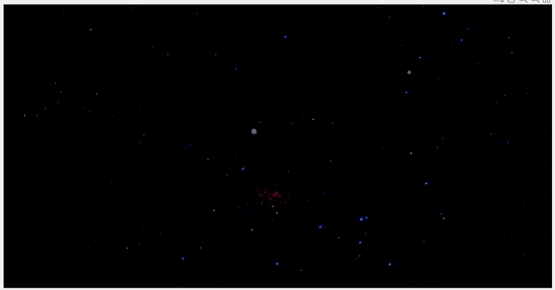</td>
  </tr>
</table>

---

## Contrast
Adjust the contrast of the working image.

<table>
  <tr>
    <th>Preview</th>
  </tr>
  <tr>
    <td>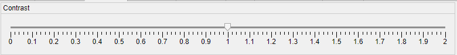</td>
  </tr>
</table>

- **Slider range:** `0` to `2`  
  - `0` = no contrast (uniform gray)  
  - `1` = unchanged  
  - `2` = maximum contrast
  
**Usage:**
<!-- Contrast Table -->
<table>
  <tr>
    <th>Value</th>
    <th>Result</th>
  </tr>
  <tr>
    <td>Original</td>
    <td></td>
  </tr>
  <tr>
    <td>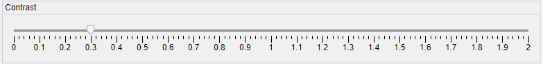</td>
    <td>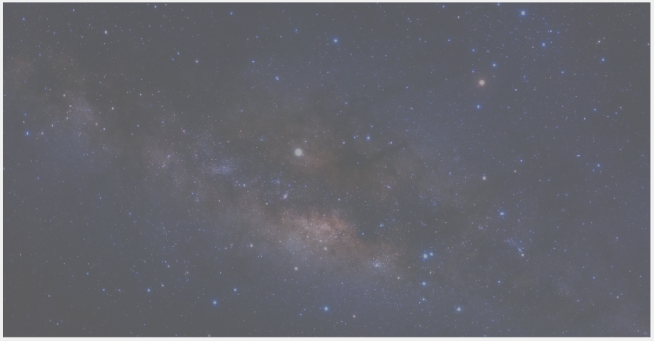</td>
  </tr>
  <tr>
    <td>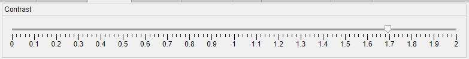</td>
    <td>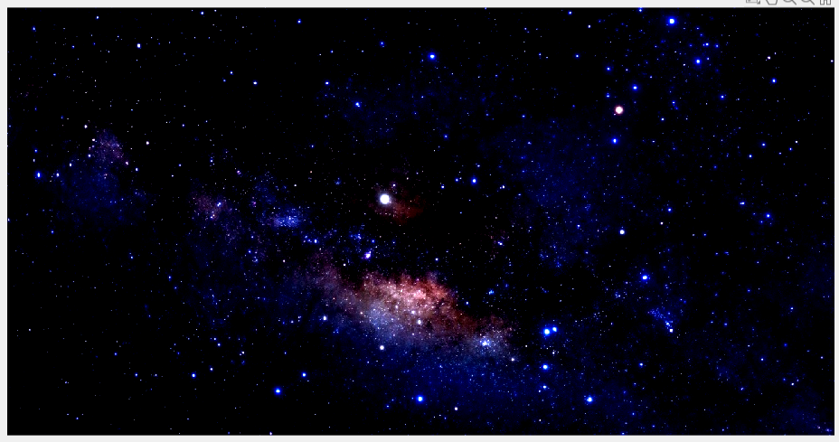</td>
  </tr>
</table>

---

## Saturation
Adjust color saturation of the working image.

<table>
  <tr>
    <th>Preview</th>
  </tr>
  <tr>
    <td>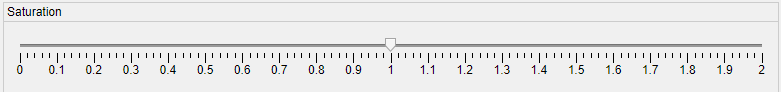</td>
  </tr>
</table>

- **Slider range:** `0` to `2`  
  - `0` = monochrome  
  - `1` = unchanged  
  - `2` = maximum saturation  

**Usage:**
<!-- Saturation Table -->
<table>
  <tr>
    <th>Value</th>
    <th>Result</th>
  </tr>
  <tr>
    <td>Original</td>
    <td></td>
  </tr>
  <tr>
    <td>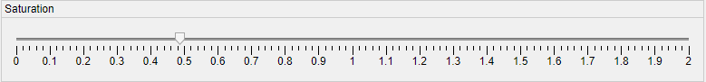</td>
    <td></td>
  </tr>
  <tr>
    <td>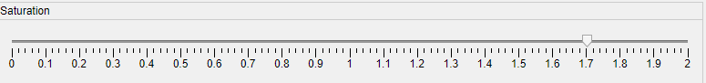</td>
    <td>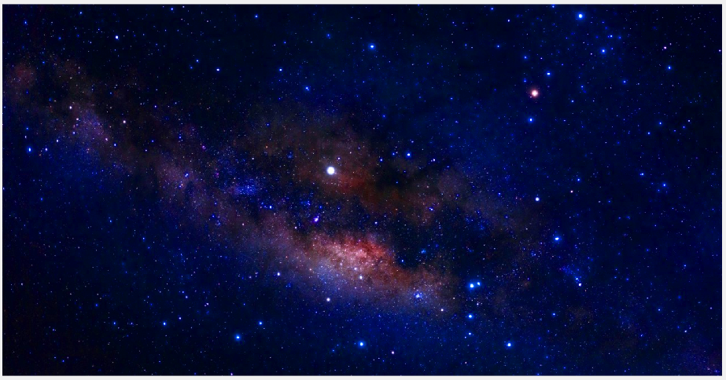</td>
  </tr>
</table>

---

## Sharpness
Enhances image sharpness by emphasizing edges (opposite of blur).

<table>
  <tr>
    <th>Preview</th>
  </tr>
  <tr>
    <td>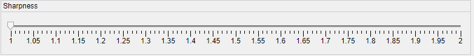</td>
  </tr>
</table>

- **Slider range:** `1` to `2`  
  - `1` = unchanged  
  - `2` = maximum sharpness  

**Note:** Edges are extracted by subtracting a Gaussian-smoothed version of the image, then blended with the original image to enhance sharpness.

**Usage:**
<!-- Sharpness Table -->
<table>
  <tr>
    <th>Value</th>
    <th>Result</th>
  </tr>
  <tr>
    <td>Original</td>
    <td></td>
  </tr>
  <tr>
    <td>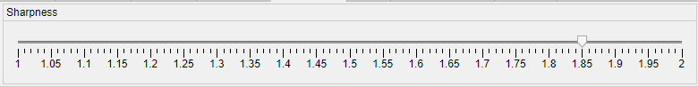</td>
    <td>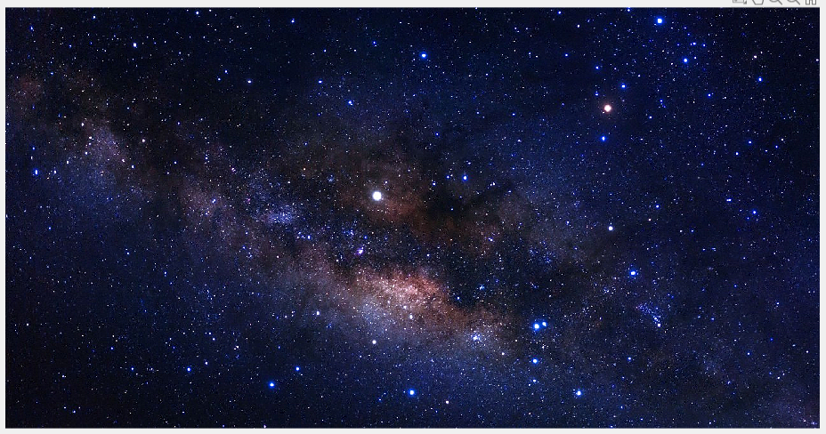</td>
  </tr>
</table>

---

## Blur
Applies Gaussian blur to the working image.

<table>
  <tr>
    <th>Preview</th>
  </tr>
  <tr>
    <td>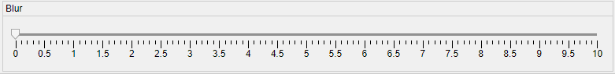</td>
  </tr>
</table>

- **Slider range:** `0` to `10`  
  - `0` = unchanged  
  - `10` = maximum blur  

**Note:** The standard deviation of the Gaussian filter is set equal to the slider value.

**Usage:**
<!-- Sharpness Table -->
<table>
  <tr>
    <th>Value</th>
    <th>Result</th>
  </tr>
  <tr>
    <td>Original</td>
    <td></td>
  </tr>
  <tr>
    <td>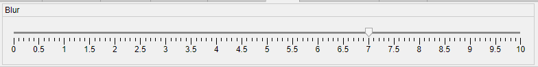</td>
    <td>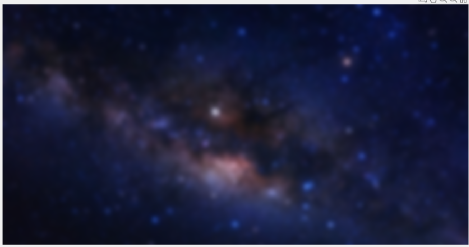</td>
  </tr>
</table>

---

## Noise Reduction
Removes noise while preserving edges.

<table>
  <tr>
    <th>Preview</th>
  </tr>
  <tr>
    <td>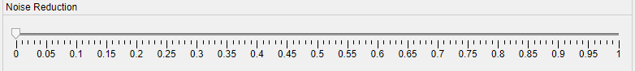</td>
  </tr>
</table>

- **Slider range:** `0` to `1`  
  - `0` = unchanged  
  - `1` = strong smoothing of fine details, edges preserved  

**Note:** Uses a bilateral filter for edge-preserving smoothing.

**Usage:**
<!-- Sharpness Table -->
<table>
  <tr>
    <th>Value</th>
    <th>Result</th>
  </tr>
  <tr>
    <td>Original</td>
    <td></td>
  </tr>
  <tr>
    <td>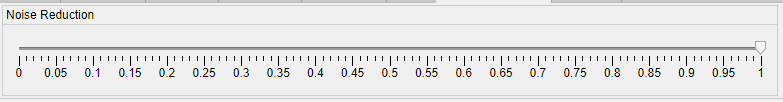</td>
    <td></td>
  </tr>
</table>

---

## Warmth (Temperature)
Adjusts the overall color temperature of the image.

table>
  <tr>
    <th>Preview</th>
  </tr>
  <tr>
    <td>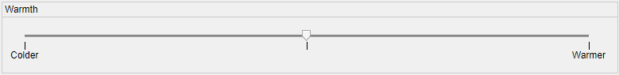</td>
  </tr>
</table>

- **Slider range:** `-100` to `100`  
  - Negative = cooler tones (blue)  
  - `0` = unchanged  
  - Positive = warmer tones (red)  

**Note:** The slider increases the red channel and decreases the blue channel accordingly.

**Usage:**
<!-- Sharpness Table -->
<table>
  <tr>
    <th>Value</th>
    <th>Result</th>
  </tr>
  <tr>
    <td>Original</td>
    <td></td>
  </tr>
  <tr>
    <td>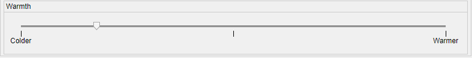</td>
    <td>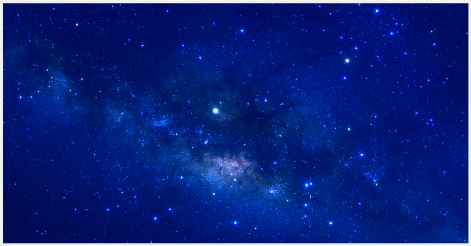</td>
  </tr>
  <tr>
    <td></td>
    <td>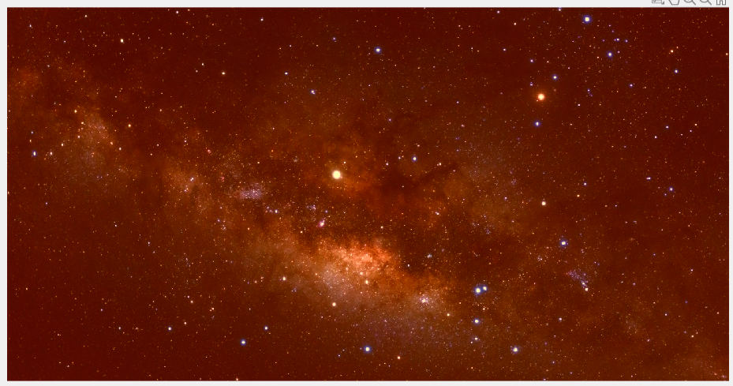</td>
  </tr>
</table>
