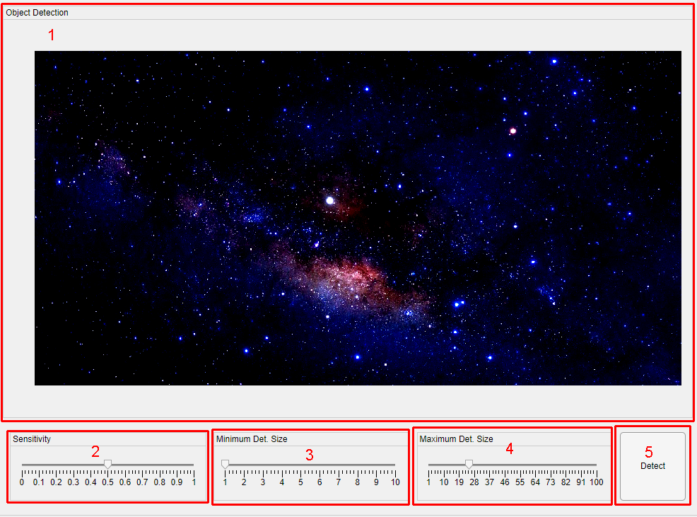
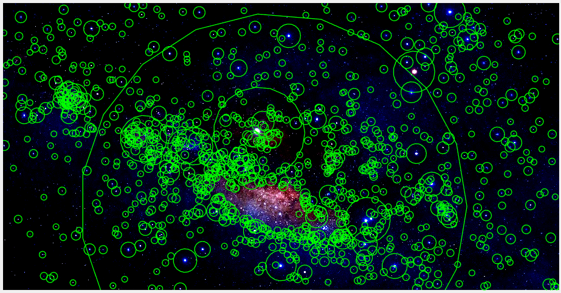
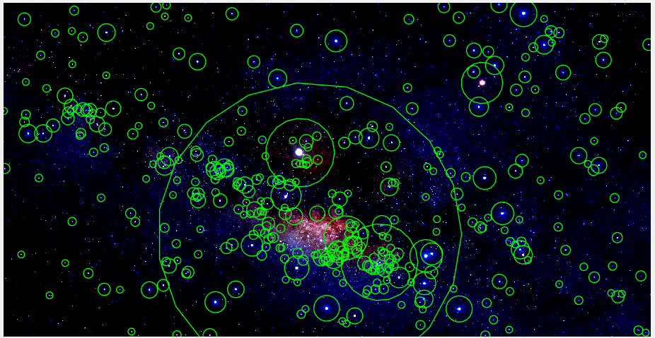
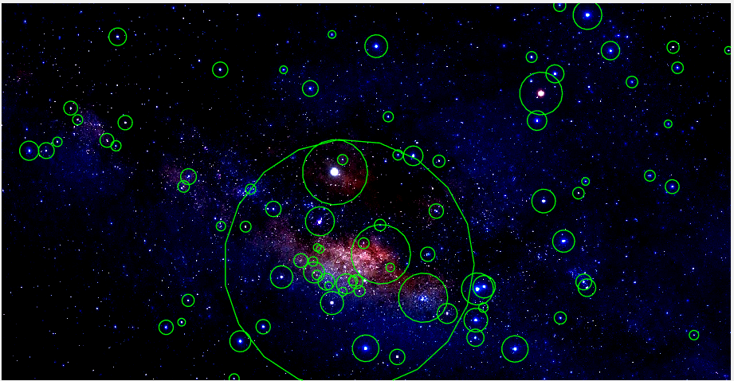
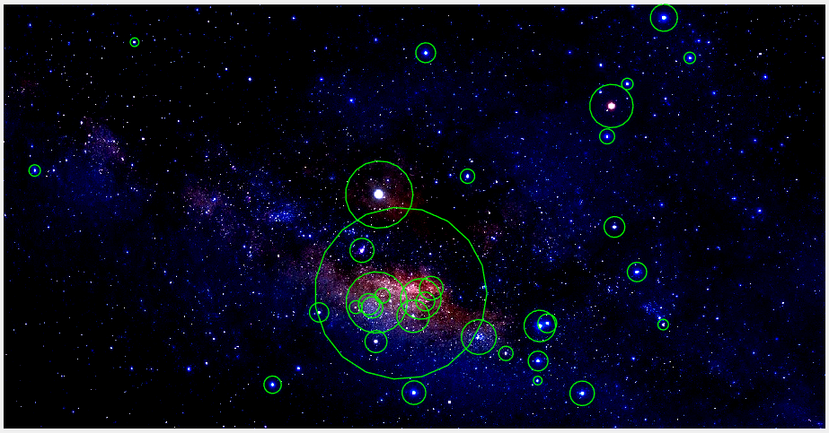
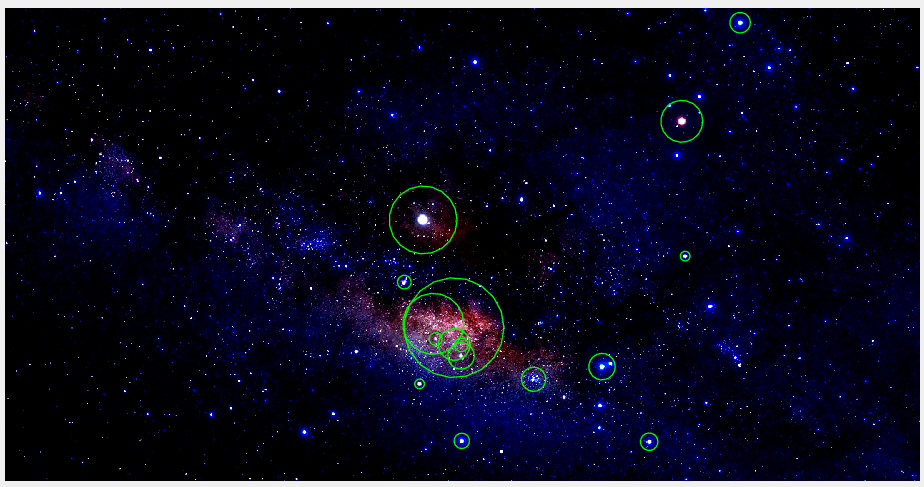
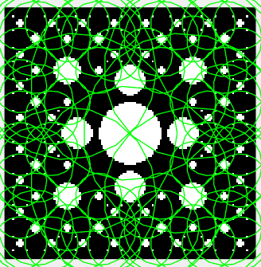
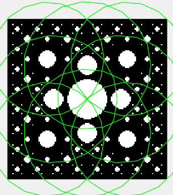
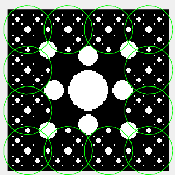
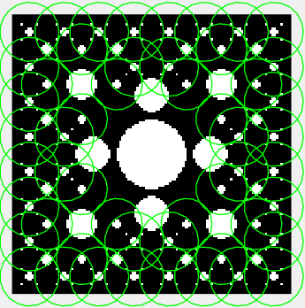

[Back](index.md)

# Detection Tab

The **Detection** tab automatically identifies astronomical objects in the working image.

---

## Table of Contents

- [Detection Parameters](#detection-parameters)
- [Detection Workflow](#detection-workflow)
- [Example Parameter Effects](#example-parameter-effects)

---

## Features

1. **Preview Window:** Displays the working image with detected objects.
2. **Sensitivity Slider:** Adjusts detection threshold.
    - Lower values -> detect faint, low-contrast objects  
    - Higher values -> detect bright, clear objects
3. **Minimum Size Slider:** Sets the minimum radius (in pixels) for a potential object to be considered.
4. **Maximum Size Slider:** Sets the maximum radius (in pixels) for a potential object.
5. **Detect Button:** Starts the detection process.

## Detection Parameters

| Parameter         | Range / Notes                                           |
|------------------|--------------------------------------------------------|
| Sensitivity       | 0.0 – 1.0 (lower = detect faint objects, higher = detect bright objects) |
| Minimum Size      | Pixels (minimum radius of detectable object)           |
| Maximum Size      | Pixels (maximum radius of detectable object)           |

---

## Detection Workflow

Detection is performed in several steps:

1. Convert the working image to **grayscale**.  
2. Smooth the grayscale image using a **Gaussian filter**.  
3. Apply a **binary threshold** based on the Sensitivity slider.  
4. Remove all objects smaller than **Min Size** using `bwareaopen()`.  
5. Identify **connected components** using `bwconncomp()`.  
6. Extract object **centroid** and **area** using `regionprops()`.  
7. Compute the **radius** of each object and compare it to the min/max boundaries.

---

## Example Parameter Effects

<table>
  <tr>
    <th>Sensitivity</th>
    <th>Result</th>
  </tr>
  <tr>
    <td>0</td>
    <td></td>
  </tr>
  <tr>
    <td>0.25</td>
    <td></td>
  </tr>
  <tr>
    <td>0.5</td>
    <td></td>
  </tr>
   <tr>
    <td>0.75</td>
    <td></td>
  </tr>
  <tr>
    <td>1</td>
    <td></td>
  </tr>
</table>

<table>
  <tr>
    <th>Min. detection Size</th>
    <th>Max. detection Size</th>
    <th>Result</th>
  </tr>
  <tr>
    <td>1</td>
    <td>100</td>
    <td></td>
  </tr>
  <tr>
    <td>5</td>
    <td>15</td>
    <td></td>
  </tr>
  <tr>
    <td>3</td>
    <td>4</td>
    <td></td>
  </tr>
   <tr>
    <td>1</td>
    <td>2</td>
    <td></td>
  </tr>
</table>
