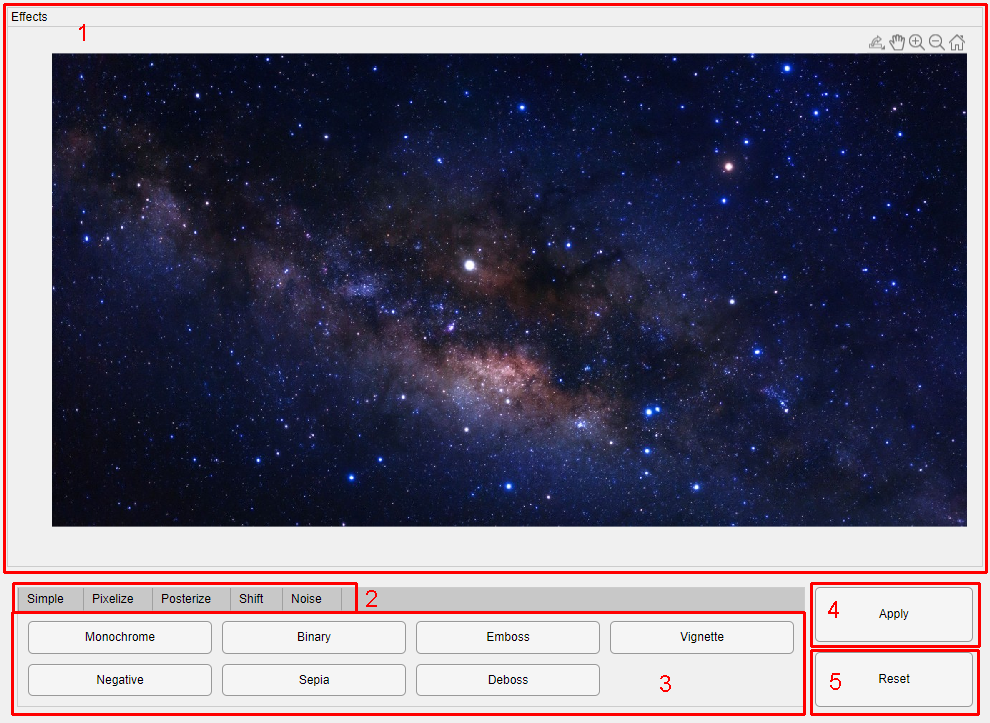
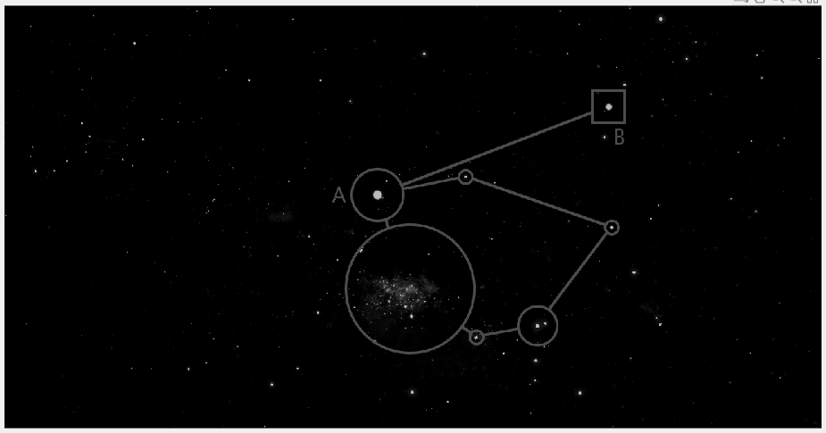
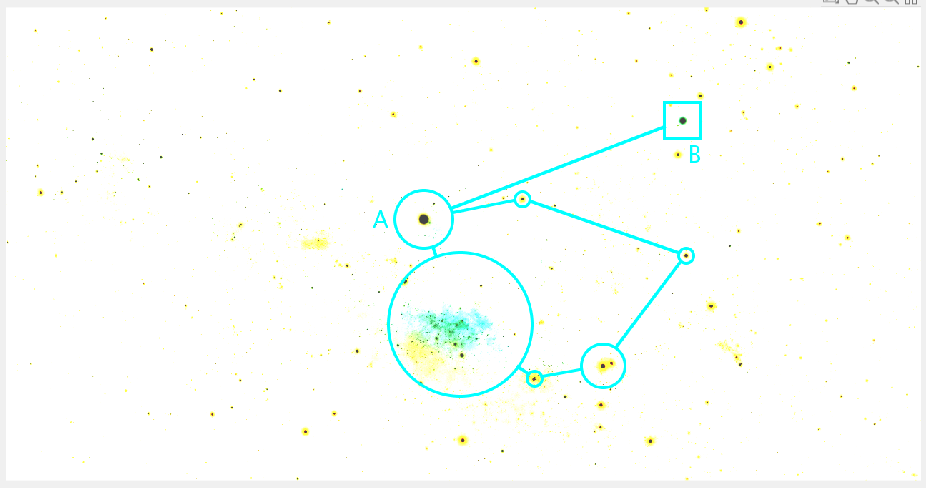
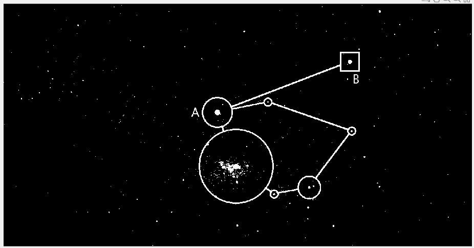
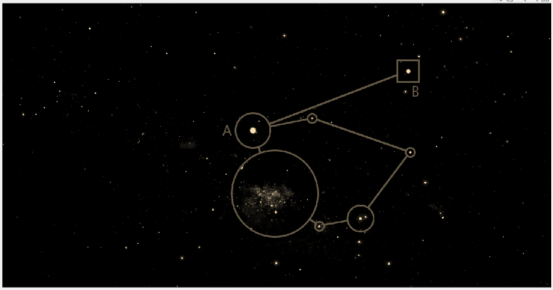
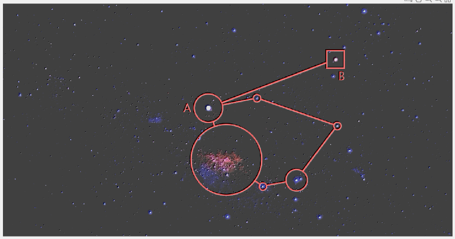
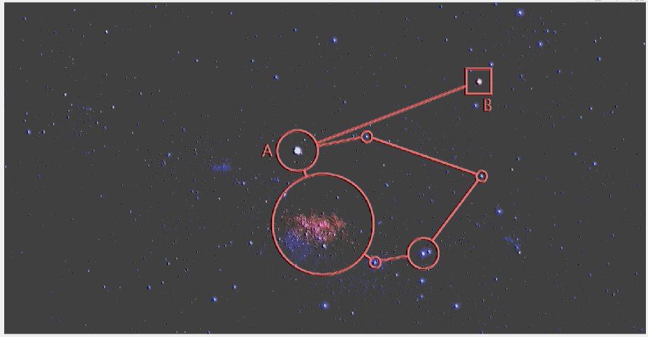
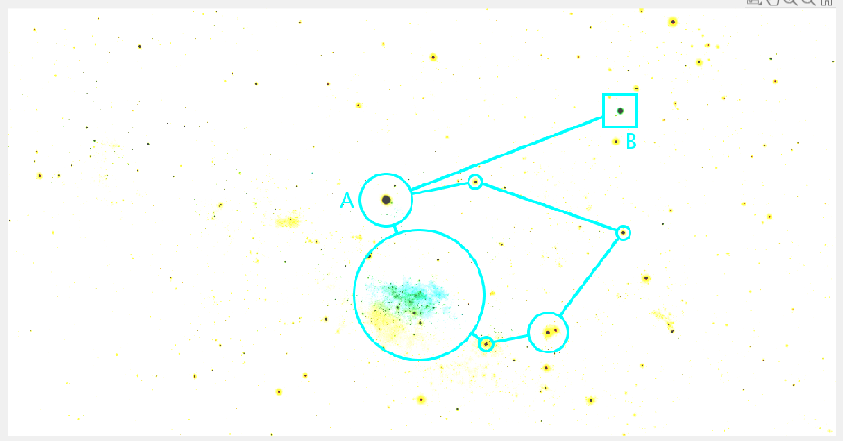
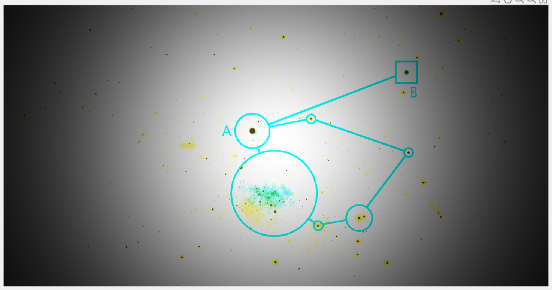

[Back](index.md)

# Effects Tab

The **Effects** tab allows applying various visual filters and stylistic transformations to the working image.

---

## Available effects

- [Monochrome](#monochrome)
- [Negative](#negative)
- [Binary](#binary)
- [Sepia](#sepia)
- [Emboss](#emboss)
- [Deboss](#deboss)
- [Vignette](#vignette)

- [Pixelize](#pixelize)
- [Posterize](#posterize)
- [Shift](#shift)
- [Noise](#noise)

---

## Features

1. **Preview Window:** Displays the working image with applied effects.
2. **Filter Selection Panel:** Choose an effect to apply.
3. **Control Panel:**
4. **Apply Changes:** Applies the selected effect.
5. **Undo Last Change:** Reverts the last applied effect.

---

## Monochrome

Removes all color information from the image.

<table>
  <tr>
    <td>Original</td>
    <td></td>
  </tr>
  <tr>
    <td>Effect</td>
    <td></td>
  </tr>
</table>

---

## Negative

Inverts colors to their complementary values.

<table>
  <tr>
    <td>Original</td>
    <td></td>
  </tr>
  <tr>
    <td>Effect</td>
    <td></td>
  </tr>
</table>

---

## Binary

Converts the image into a black-and-white representation.

<table>
  <tr>
    <td>Original</td>
    <td></td>
  </tr>
  <tr>
    <td>Effect</td>
    <td></td>
  </tr>
</table>

---

## Sepia

Applies a warm, vintage tone similar to old photographs.

<table>
  <tr>
    <td>Original</td>
    <td></td>
  </tr>
  <tr>
    <td>Effect</td>
    <td></td>
  </tr>
</table>

---

## Emboss

Creates a raised, 3D-like effect emphasizing edges.

<table>
  <tr>
    <td>Original</td>
    <td></td>
  </tr>
  <tr>
    <td>Effect</td>
    <td></td>
  </tr>
</table>

---

## Deboss

Creates an indented, 3D-like effect.

<table>
  <tr>
    <td>Original</td>
    <td></td>
  </tr>
  <tr>
    <td>Effect</td>
    <td></td>
  </tr>
</table>

---

## Vignette

Darkens the edges of the image to emphasize the center.

<table>
  <tr>
    <td>Original</td>
    <td></td>
  </tr>
  <tr>
    <td>Effect</td>
    <td></td>
  </tr>
</table>

---

