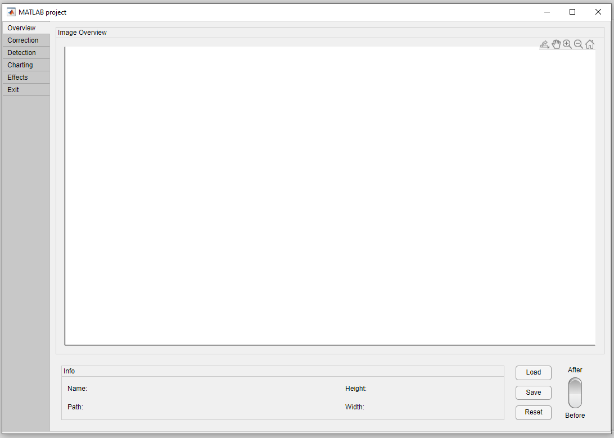

# Astronomical Image Mapper - User Guide

This application guides users through all stages of creating a star map - from loading and correcting an image, through object detection and charting, to applying visual effects.  

The application is organized into separate tabs to provide a **clear, step-by-step workflow** and to keep each functionality **self-contained**.  

- [Overview](overview.md)
- [Correction](correction.md)
- [Detection](detection.md)
- [Charting](charting.md)
- [Effects](effects.md)
- [Exit](exit.md)
