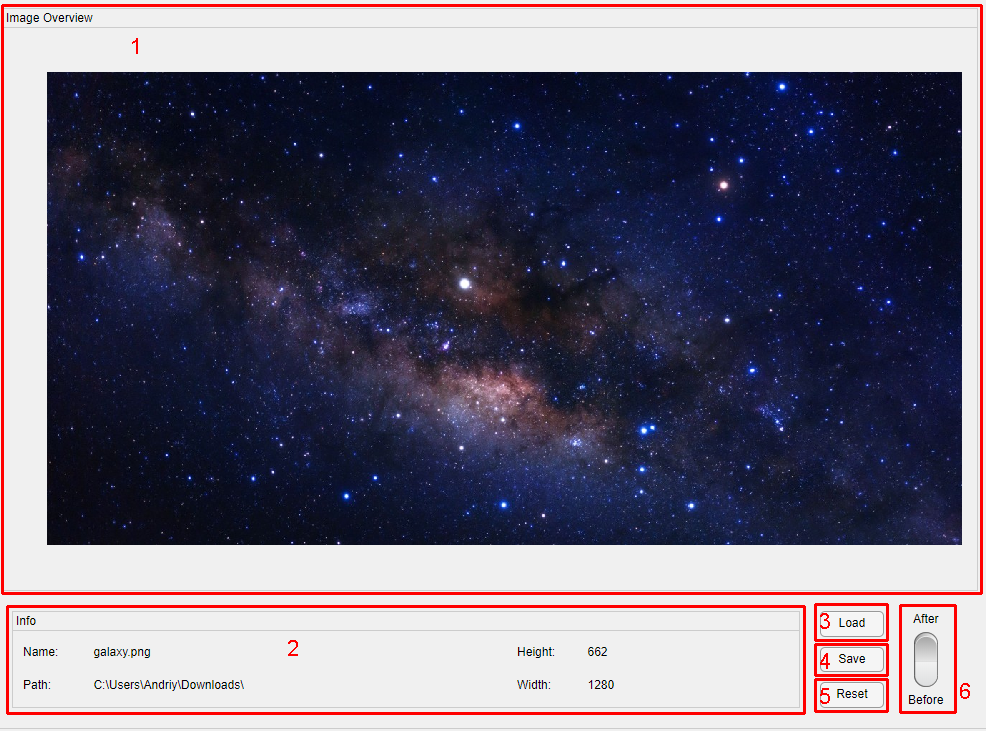

**[Back](index.md)**

# Overview Tab

The **Overview** tab allows users to manage the loaded image and view basic information before starting any processing steps.

---

## Features

1. **Preview Window:** Displays either the original or working image.
2. **Image Information:** Shows image name, file path, width, and height.
3. **Load Image Button:** Supports `*.png | *.jpg | *.bmp` files. Opens a file dialog.
4. **Save Image Button:** Saves the current working image. Opens a file dialog.
5. **Reset Changes Button:** Restores the working image to its original version.
6. **View Toggle:** Switch between the original image and the processed image.
